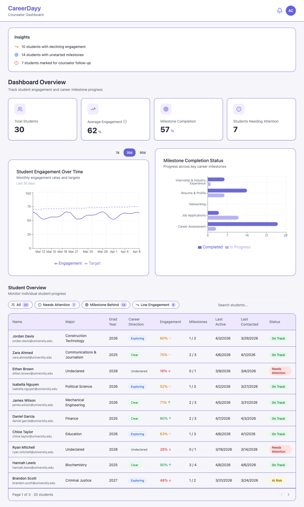

<div align="center">

# 🎓 CareerDay — Counselor Dashboard

### A counselor-facing analytics dashboard that gives advisors a live, at-a-glance view of every student's career readiness — backed by a real 47-student pilot.


**Live:** [careerday.vercel.app](https://careerday.vercel.app)

</div>

---

<div align="center">

### Every student's career readiness at a glance



</div>

---

## What it is

Counselors need a consolidated view of each student's career readiness — without digging through
separate tools or asking students to self-report in meetings. The **Counselor Dashboard** brings a
student's career narrative, milestone progress, advisor notes, and recent activity into a single,
scannable interface.

It runs on a **real 47-student pilot dataset** (Queens College) imported from CSV and stored in
**Supabase** — students, milestones, KPI aggregates, and advisor notes all persist and survive
refreshes and redeploys.

## Dashboard sections

- **KPI cards** — total students, average engagement, milestone completion rate, students needing
  attention. Values come from a database **view**, not computed in the browser.
- **Engagement distribution** — a histogram binning students across five engagement bands, for a
  quick read on cohort health.
- **Milestone completion chart** — completed vs. in-progress across the five milestone categories,
  always showing all five (an empty one reads as "no data yet," not a bug).
- **Insights panel** — auto-computed alerts: low-engagement students not contacted recently, and
  students with no milestones started.
- **Student table** — filterable/searchable (filter chips + free-text on ID, email, major).
- **Student detail drawer** — follow-up check-in with an **8-second undo**, career narrative,
  academic profile, milestone add/delete, timestamped advisor notes, and a recent-activity feed.

## Data & architecture

```
App.tsx (on mount) ──▶ src/data/queries.ts ──▶ Supabase (PostgreSQL)
                                                 ├── students, milestones, advisor_notes, recent_activity   (4 tables)
                                                 └── student_kpi_summary, milestone_category_summary          (2 SQL views)
```

- **Server-side aggregation.** KPI and milestone-completion numbers are computed in **SQL views**, so
  the browser reads pre-computed rows instead of aggregating over the full dataset on every render.
- **Centralized data access.** Every database call lives in `src/data/queries.ts`; the root component
  fetches on mount and passes results down as props — no component queries Supabase directly.
- **Runtime validation.** **Zod** schemas validate rows crossing the network boundary before they
  reach React state.

## Highlights

- **Real pilot, real persistence** — 47 CUNY students in Supabase across a normalized 4-table schema
  with 2 server-side aggregation views.
- **150 automated tests** (Vitest + React Testing Library) across 14 files, behind a CI gate
  (format + lint + build).
- **Design system** — an 8-phase alignment to a Figma prototype: a tokenized purple theme expressed
  as HSL CSS custom properties, accessible empty states and ARIA labels.
- **Resilience** — error boundaries, cancellation-guarded async, and a follow-up flow with an
  undo-with-countdown, hardened after a self-run audit.

## Tech stack

| Layer | Technology |
|-------|------------|
| Framework | Vite + React + TypeScript |
| Styling | Tailwind CSS + shadcn/ui (Radix) |
| Table | TanStack Table v8 |
| Charts | Recharts |
| Validation | Zod |
| Database | Supabase (PostgreSQL) |
| Tests | Vitest + React Testing Library |
| Deployment | Vercel |

## Getting started

```bash
cd dashboard
pnpm install
# create dashboard/.env.local with VITE_SUPABASE_URL and VITE_SUPABASE_ANON_KEY (see dashboard/README.md)
pnpm dev            # → http://localhost:5173
pnpm test --run     # 150 tests
pnpm build          # production build (CI gate)
```

Full setup, schema, and deployment notes: [`dashboard/README.md`](dashboard/README.md).
